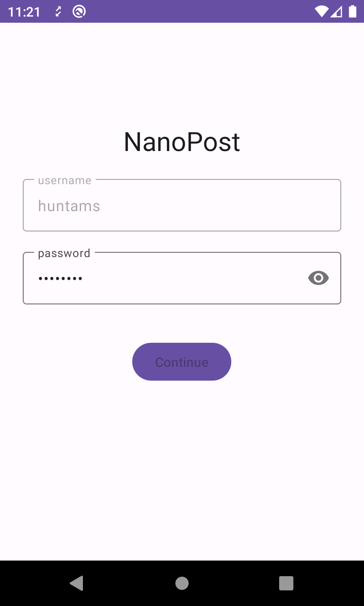
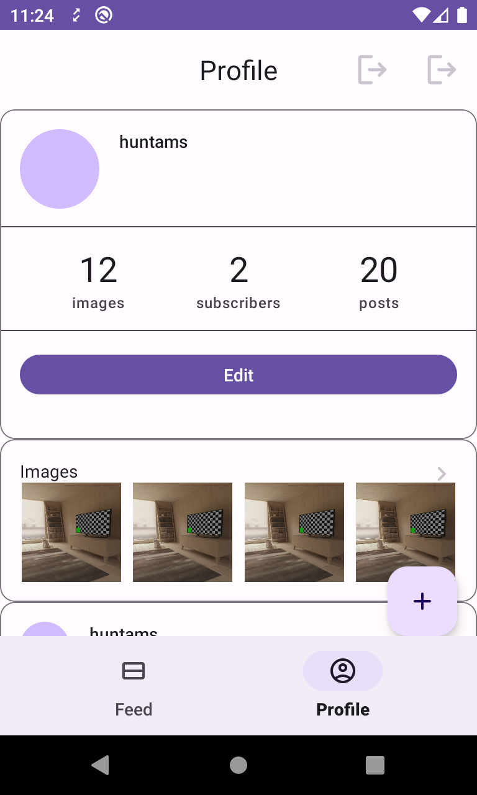
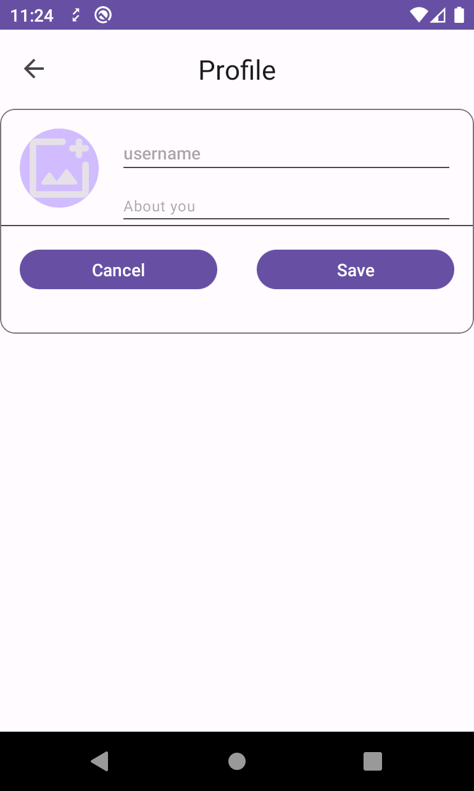
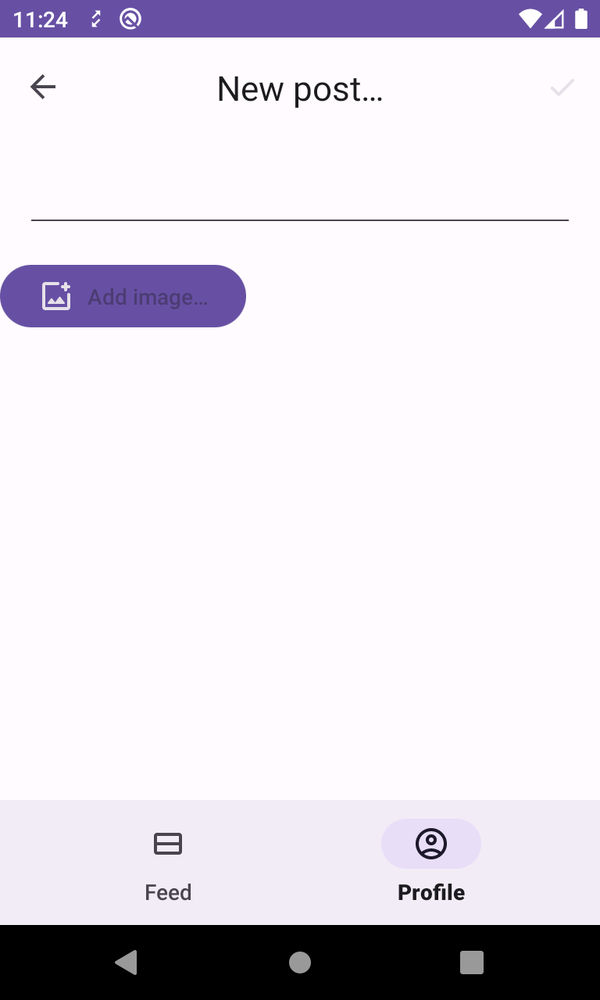
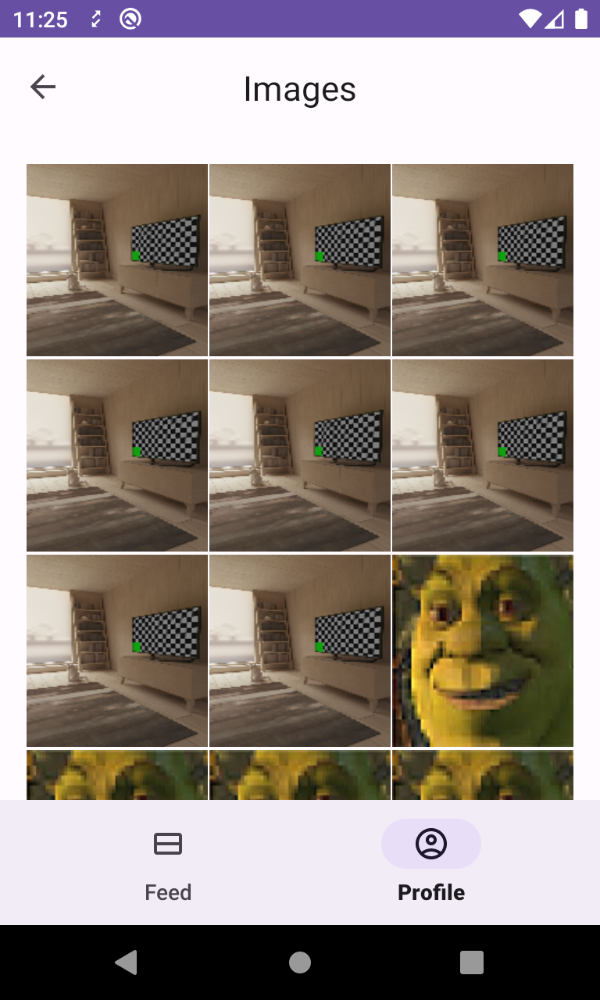
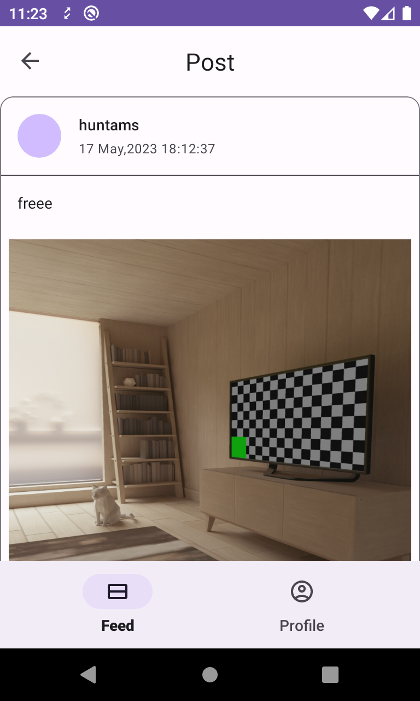
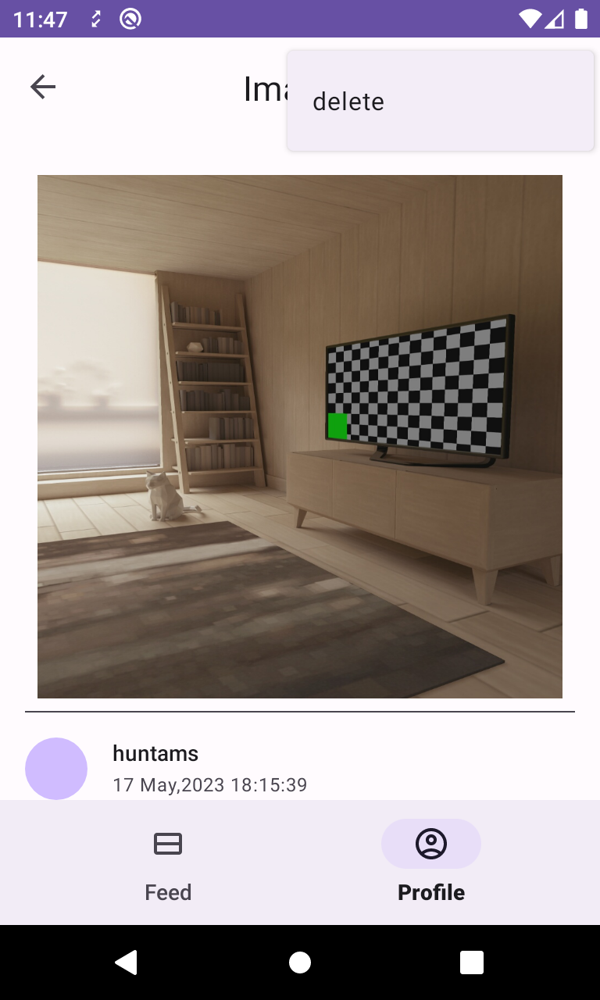
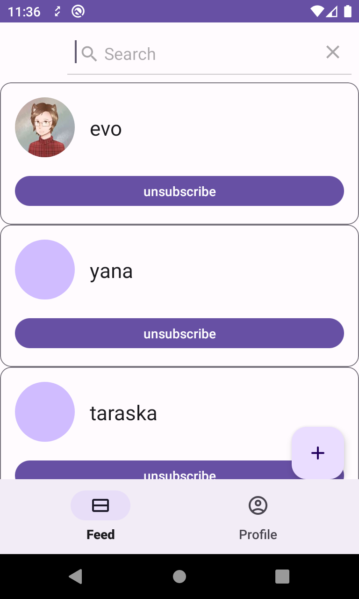
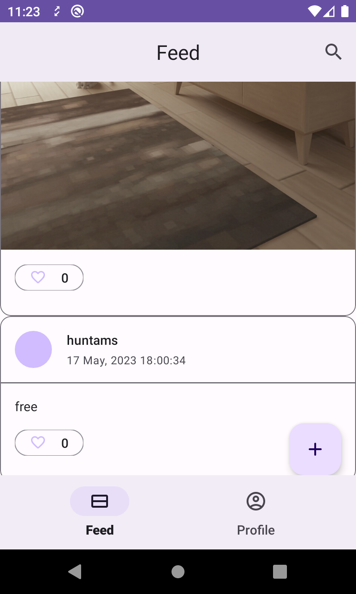

# Nanopost

## __Technologies__ 

* [Used API](https://pokeapi.co/docs/v2)
* [Kotlin](https://kotlinlang.org/)
* [SharedPreferences](https://developer.android.com/training/data-storage/shared-preferences)
* [safeargs](https://developer.android.com/guide/navigation/use-graph/pass-data)
* [LiveData](https://developer.android.com/topic/libraries/architecture/livedata)
* [ViewModel](https://developer.android.com/topic/libraries/architecture/viewmodel)
* [Kotlin Coroutines](https://developer.android.com/kotlin/coroutines)
* [ViewBindingPropertyDelegate](https://github.com/androidbroadcast/ViewBindingPropertyDelegate)
* [Hilt](https://developer.android.com/training/dependency-injection/hilt-android)

## __Screenshots__

